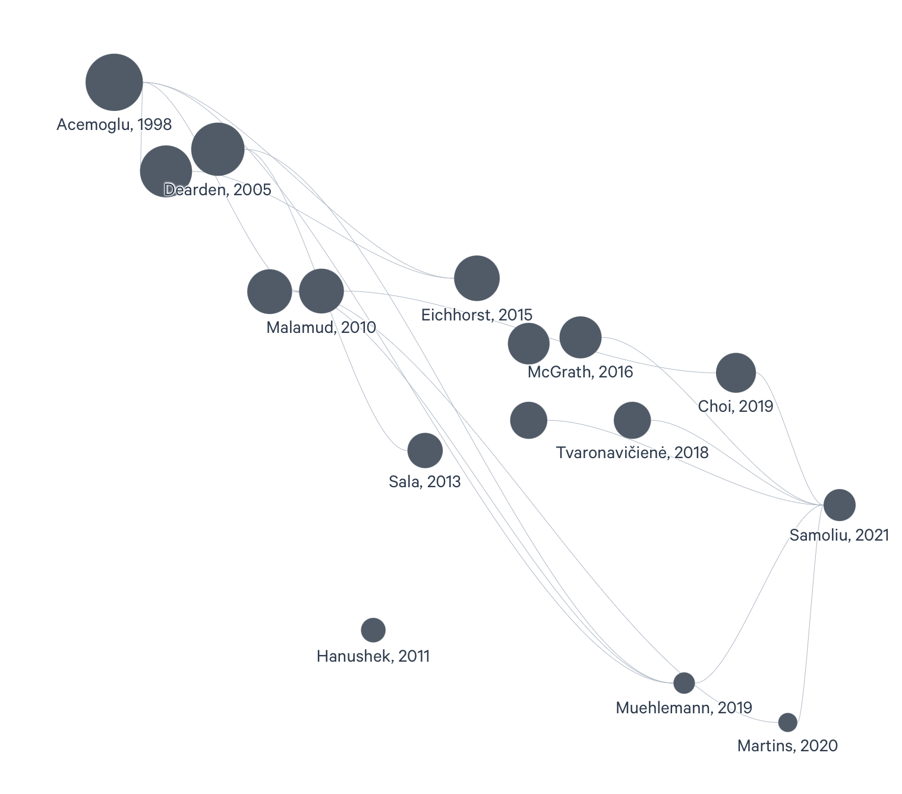

# References

*Figure: Citation network of key literature on vocational training and economic outcomes*

---

Acemoglu, D., & Pischke, J.-S. (1998). Why do firms train? Theory and evidence. *The Quarterly Journal of Economics, 113*(1), 79–119.

Acemoglu, D., & Pischke, J.-S. (1999). The structure of wages and investment in general training. *Journal of Political Economy, 107*(3), 539–572.

Becker, G. S. (1964). *Human capital: A theoretical and empirical analysis, with special reference to education*. University of Chicago Press.

Choi, S. J., Jeong, J.-C., & Kim, S. N. (2019). Impact of vocational education and training on adult skills and employment: An applied multilevel analysis. *International Journal of Educational Development, 66*, 129–138. https://doi.org/10.1016/j.ijedudev.2018.09.007

Dearden, L., Reed, H., & Van Reenen, J. (2006). The impact of training on productivity and wages: Evidence from British panel data. *Oxford Bulletin of Economics and Statistics, 68*(4), 397–421. https://doi.org/10.1111/j.1468-0084.2006.00170.x

Eichhorst, W. (2015). Does vocational training help young people find a (good) job? *IZA World of Labor*, 112. https://doi.org/10.15185/izawol.112

Eichhorst, W., Rodríguez-Planas, N., Schmidl, R., & Zimmermann, K. F. (2015). A road map to vocational education and training in industrialized countries. *ILR Review, 68*(2), 314–337. https://doi.org/10.1177/0019793914564963

Eurostat. (2015). *Continuing Vocational Training Survey (CVTS): Cost of CVT courses by type of cost and size class* [Data set]. trng_cvt_17s. https://ec.europa.eu/eurostat

Eurostat. (2015). *GDP per capita at current market prices* [Data set]. tec00001. https://ec.europa.eu/eurostat

Hanushek, E. A., Schwerdt, G., Woessmann, L., & Zhang, L. (2017). General education, vocational education, and labor-market outcomes over the lifecycle. *Journal of Human Resources, 52*(1), 48–87. https://doi.org/10.3368/jhr.52.1.0415-7074R

Izushi, H., & Huggins, R. (2004). Empirical analysis of human capital development and economic growth in Europe. In P. Descy & M. Tessaring (Eds.), *Impact of education and training: Third report on vocational training research in Europe: Background report* (pp. 71–118). Office for Official Publications of the European Communities.

Malamud, O., & Pop-Eleches, C. (2010). General education versus vocational training: Evidence from an economy in transition. *The Review of Economics and Statistics, 92*(1), 43–60. https://doi.org/10.1162/rest.2009.11339

Martins, P. S. (2020). The microeconomic impacts of vocational training: Evidence from a large administrative dataset. *IZA Discussion Paper No. 13758*.

McGrath, S., & Powell, L. (2016). Skills for sustainable development: Transforming vocational education and training beyond 2015. *International Journal of Educational Development, 50*, 12–19. https://doi.org/10.1016/j.ijedudev.2016.05.006

Mincer, J. (1974). *Schooling, experience, and earnings*. Columbia University Press.

Muehlemann, S., & Wolter, S. C. (2019). The economics of vocational training. In S. McGrath, M. Mulder, J. Papier, & R. Suart (Eds.), *Handbook of vocational education and training* (pp. 1–17). Springer.

Sala, H., & Silva, J. I. (2013). Labor productivity and vocational training: Evidence from Europe. *Journal of Productivity Analysis, 40*(1), 31–41. https://doi.org/10.1007/s11123-012-0304-0

Samoliu, A. (2021). Vocational education and training systems in the European Union: A comparative analysis. *European Journal of Education Studies, 8*(4), 112–135.

Schultz, T. W. (1961). Investment in human capital. *The American Economic Review, 51*(1), 1–17.

Tvaronavičienė, M., Tarkhanova, E., & Durglishvili, N. (2018). Sustainable economic growth and social development: Creative approaches. *Journal of International Studies, 11*(3), 9–23. https://doi.org/10.14254/2071-8330.2018/11-3/1
