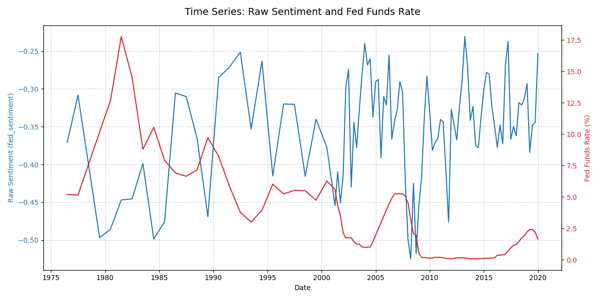

### Abstract
This paper investigates the influence of central bank communication on bank risk-taking, distinct from the conventional interest rate channel. While the \"risk-taking channel\" of monetary policy—whereby lower policy rates incentivize banks to increase risk—is well-documented (Borio & Zhu, 2012; Dell'Ariccia et al., 2017), the role of central bank communication as a separate transmission mechanism is less well explored. Drawing on literature that identifies \"non-monetary news\" within central bank announcements (Cieslak & Schrimpf, 2019; Nakamura & Steinsson, 2018), we hypothesize that communication shapes bank risk appetite through a distinct \"Sentiment Channel.\" We test this using a proprietary dataset of 640,000 bank-quarter observations from 1984 to 2019, linking textual sentiment shocks from FOMC statements to granular FFIEC Call Report data. To isolate the causal effect of communication, we employ an orthogonalization strategy to purge sentiment of interest rate correlations and an Anderson-Hsiao instrumental variable estimator to correct for dynamic panel bias. Contrary to the \"Signaling Channel\" hypothesis, we find no statistically significant evidence that Fed sentiment affects bank loan-to-asset ratios once the explicit cost of capital is controlled for. Our results suggest that while the \"Information Effect\" may move high-frequency asset prices, commercial bank balance sheets are still driven primarily by inertia and the Federal Funds Rate."

